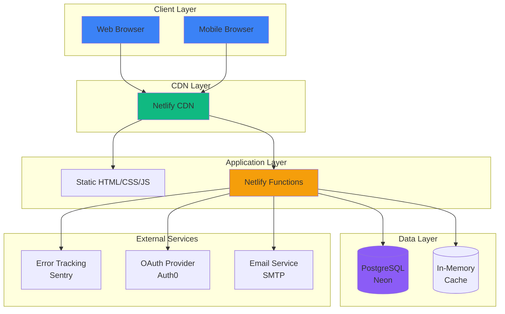
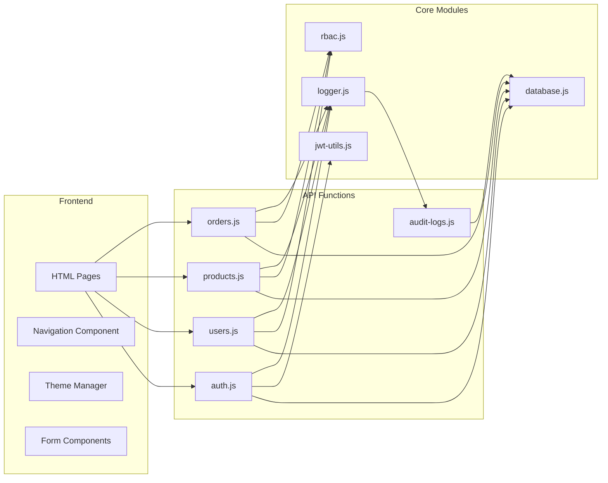
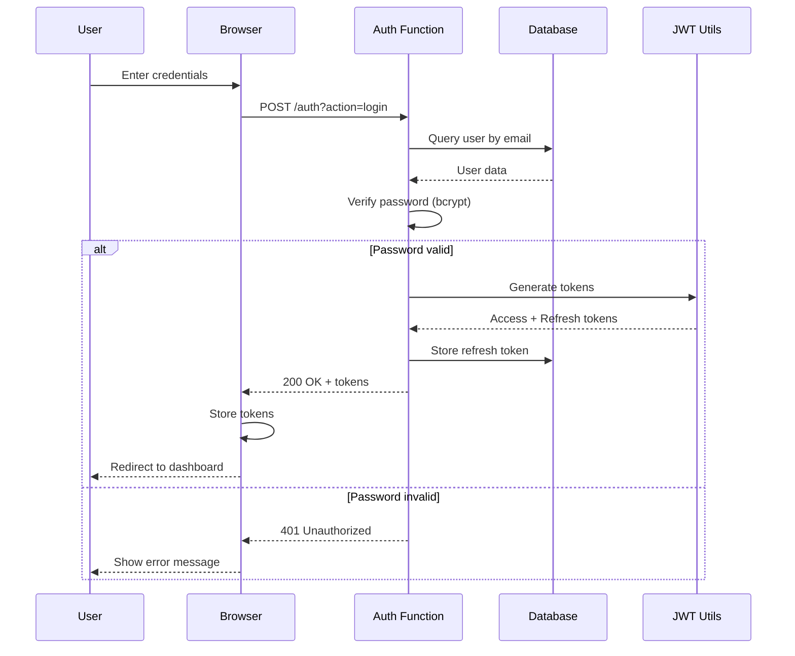
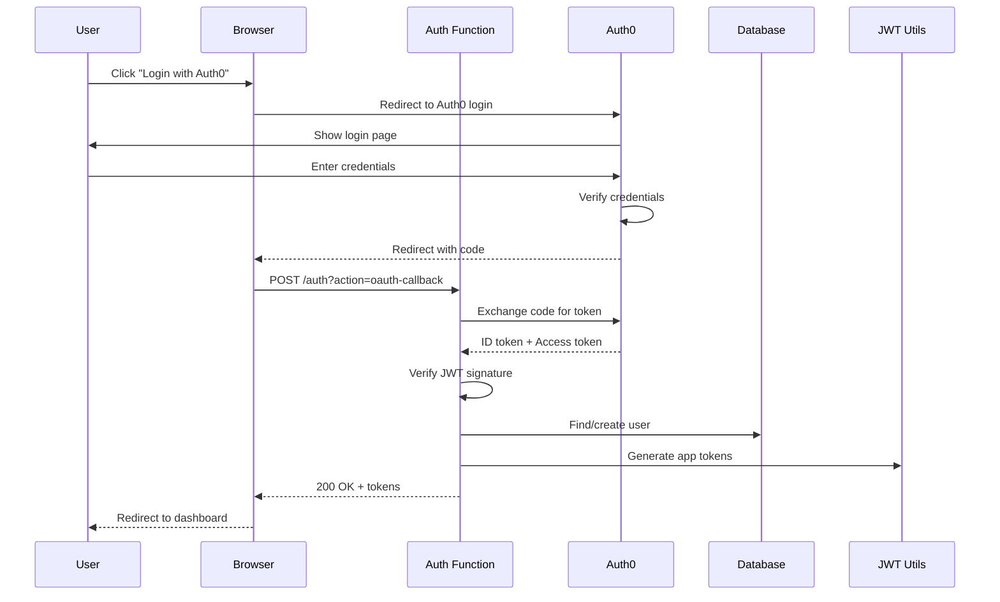
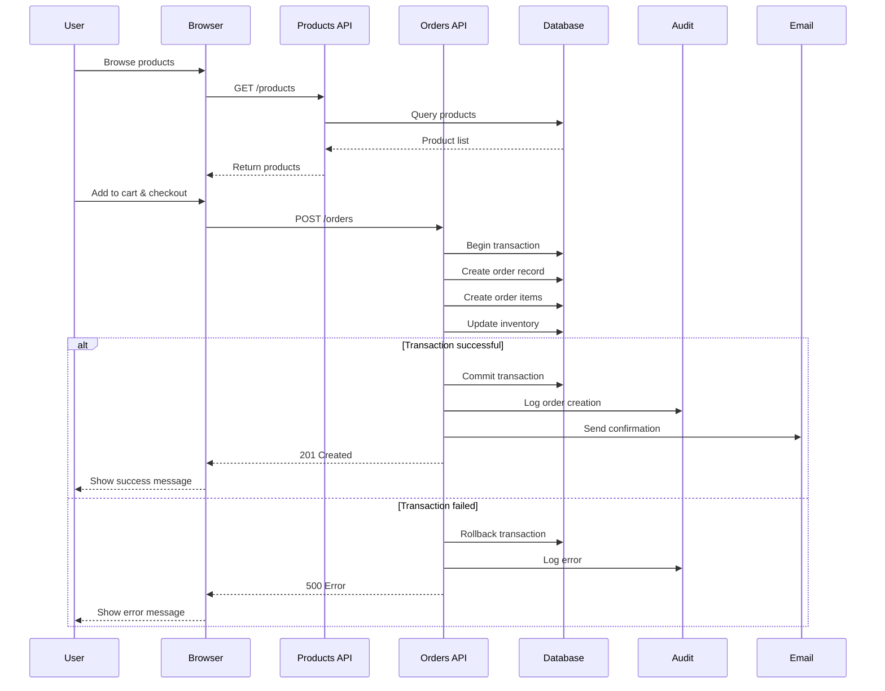
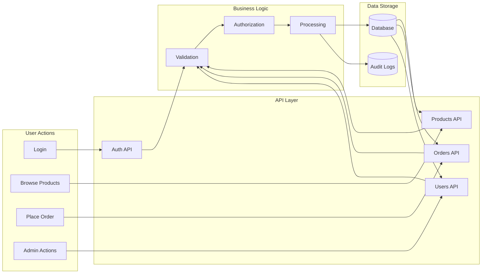
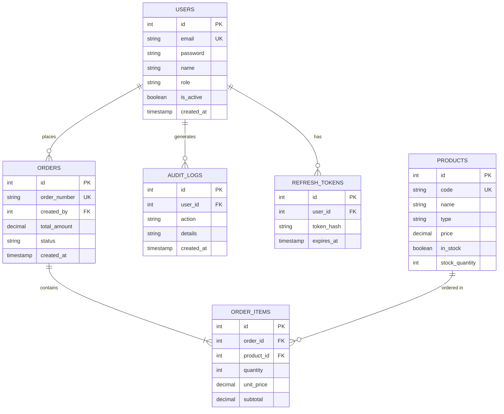
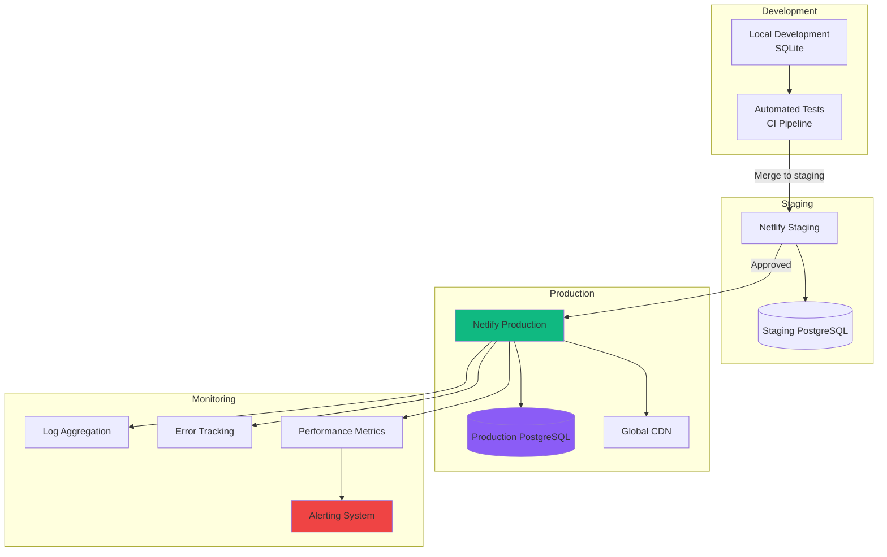
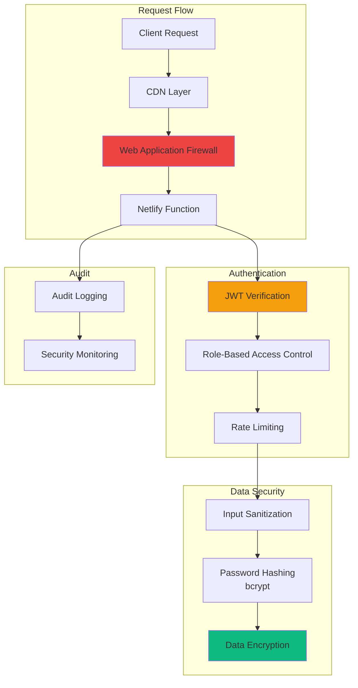
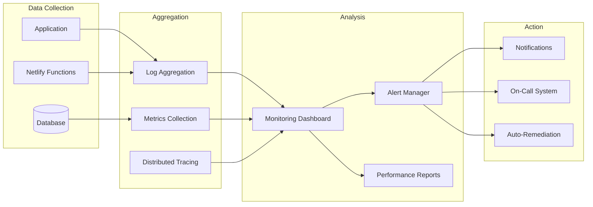

# System Architecture Documentation

## Overview

This document provides comprehensive architecture diagrams for joshburt.com.au, showing system components, data flow, and infrastructure.

## High-Level Architecture

## Component Architecture

## Authentication Flow

## OAuth Flow (Auth0)

## Order Processing Flow

## Data Flow Diagram

## Database Schema

## Deployment Architecture

## Security Architecture

## Monitoring Architecture

## Scalability Considerations

### Current Architecture
- **Static Assets**: Served via Netlify CDN (global distribution)
- **Functions**: Auto-scaling serverless (concurrent execution)
- **Database**: Managed PostgreSQL with connection pooling
- **Caching**: In-memory caching within functions

### Scaling Strategies

1. **Horizontal Scaling**
   - Functions auto-scale with demand
   - Database connection pooling prevents bottlenecks

2. **Vertical Scaling**
   - Increase function memory/timeout limits
   - Upgrade database tier as needed

3. **Caching**
   - Implement Redis for distributed caching
   - Cache frequently accessed data (products, settings)

4. **Database Optimization**
   - Add read replicas for heavy read operations
   - Implement database sharding if needed
   - Use materialized views for complex queries

## Technology Stack

| Layer | Technology | Purpose |
|-------|-----------|---------|
| Frontend | HTML5, CSS3, JavaScript | User interface |
| Styling | TailwindCSS v4 | Responsive design |
| Backend | Node.js | Serverless functions |
| Functions | Netlify Functions | API endpoints |
| Database | PostgreSQL (Neon) | Data persistence |
| Authentication | JWT, bcrypt | Security |
| OAuth | Auth0 | Third-party auth |
| Monitoring | Sentry | Error tracking |
| Deployment | Netlify, GitHub Actions | CI/CD |
| Version Control | Git, GitHub | Source control |

## Performance Characteristics

### Response Times (Target SLAs)
- **P50**: < 200ms
- **P95**: < 1000ms
- **P99**: < 3000ms

### Availability
- **Target**: 99.9% uptime
- **Downtime allowance**: ~43 minutes/month

### Throughput
- **Functions**: Auto-scaling, no hard limit
- **Database**: ~1000 concurrent connections
- **CDN**: Unlimited (Netlify CDN)

## Disaster Recovery

### Backup Strategy
- **Database**: Daily automated backups (Neon)
- **Code**: Version controlled in Git
- **Configuration**: Environment variables backed up securely

### Recovery Procedures
1. **Code Rollback**: Netlify deploy history (instant)
2. **Database Recovery**: Restore from backup (~15 minutes)
3. **Configuration**: Re-apply from backup

### RPO/RTO
- **RPO** (Recovery Point Objective): 24 hours
- **RTO** (Recovery Time Objective): 15 minutes

## Resources

- [Netlify Architecture](https://www.netlify.com/products/edge/)
- [Neon Database Architecture](https://neon.tech/docs/introduction/architecture-overview)
- [Serverless Architecture Patterns](https://docs.aws.amazon.com/lambda/latest/dg/welcome.html)
